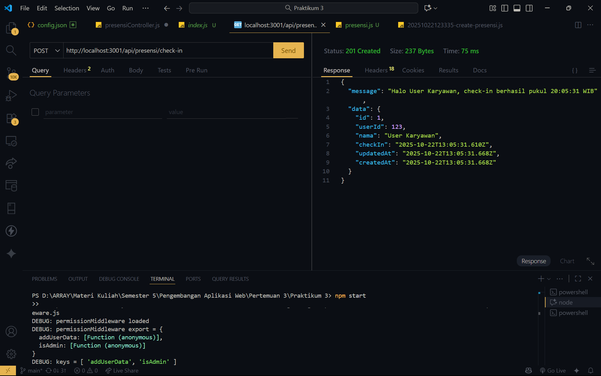
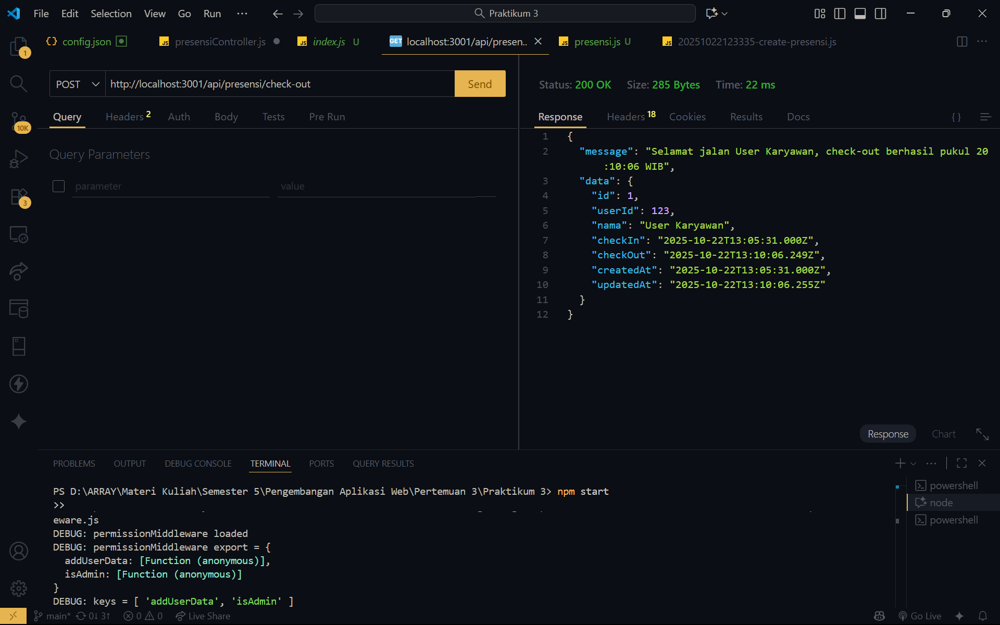
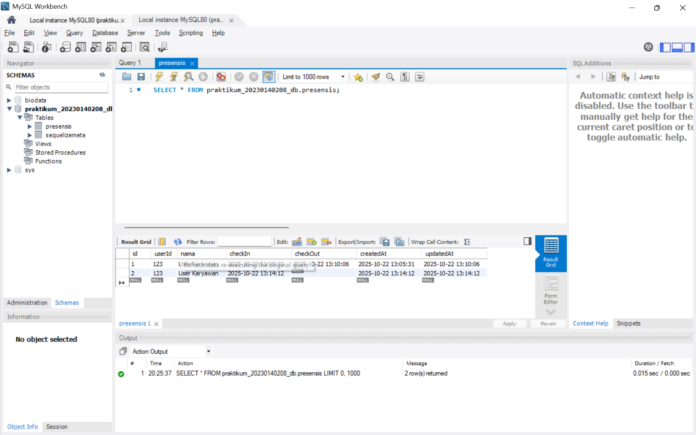
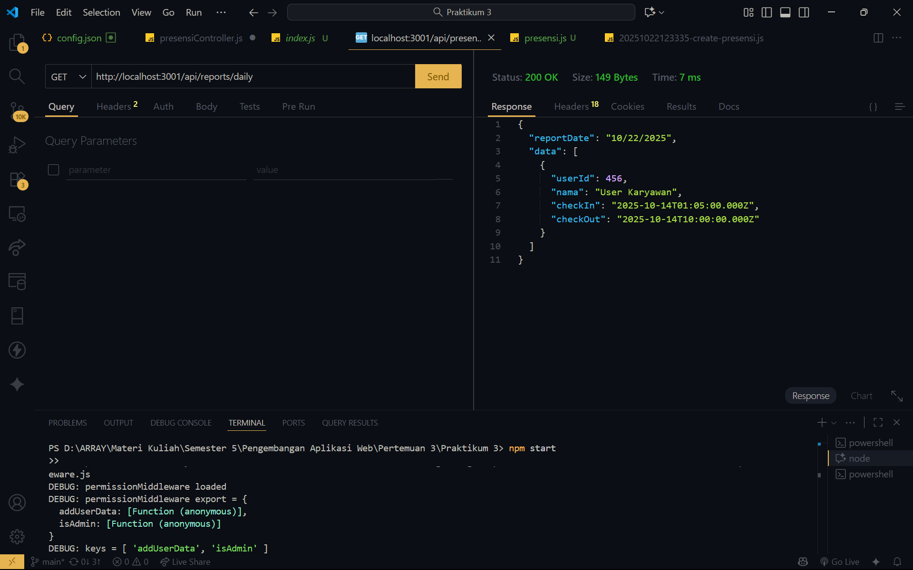

# 📘 Tugas 4 — Koneksi Database dan ORM dengan Sequelize

**Nama:** Array A.K.  
**NIM:** 20230140208  

## 🧩 1️⃣ Endpoint Check-In

Berikut bukti hasil pengujian endpoint **Check-In** menggunakan Postman:  

---

## 🧩 2️⃣ Endpoint Check-Out

Berikut bukti hasil pengujian endpoint **Check-Out** menggunakan Postman:  

---

## 🧩 3️⃣ Database Setelah Presensi

Berikut bukti bahwa data hasil presensi (check-in dan check-out) telah tersimpan ke dalam database MySQL (`praktikum_20230140208_db`) pada tabel `Presensis`:  

---

## 🧩 4️⃣ Endpoint Daily Report

Berikut hasil pengujian endpoint **Daily Report** untuk menampilkan seluruh data presensi pada tanggal yang sama:  

