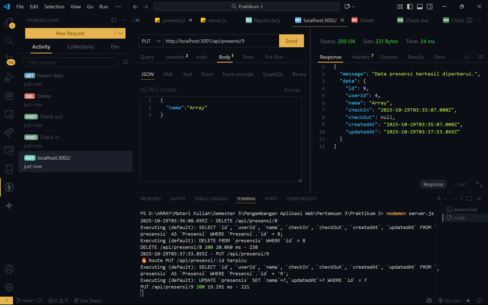
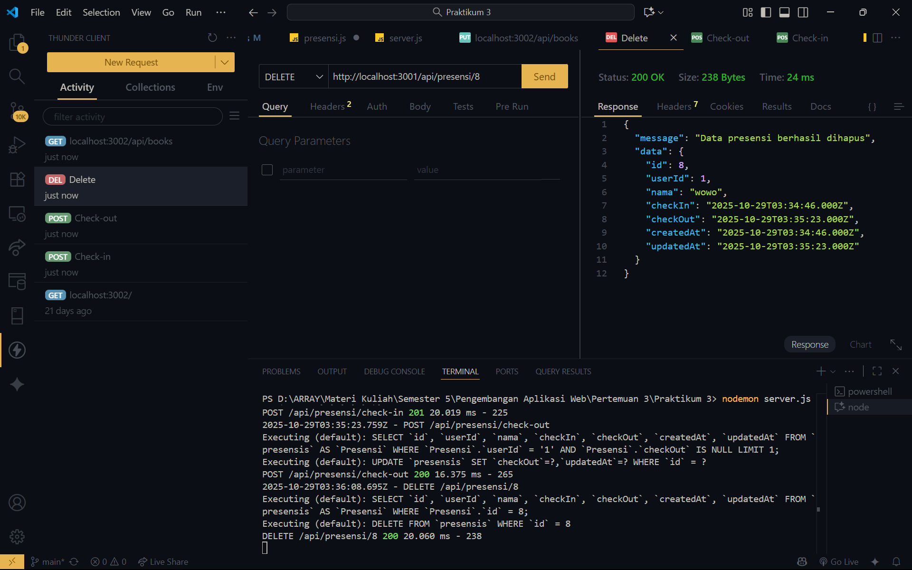

# 🧩 Tugas 5 – RESTful API dengan Express.js & Sequelize

## 📘 Identitas
**Nama:** Array A.K.  
**NIM:** _(isi di sini)_  
**Mata Kuliah:** Pengembangan Aplikasi Web  
**Pertemuan:** 5  
**Dosen Pengampu:** Ir. Asroni, S.T., M.Eng  

---

## 🎯 Tujuan
Mahasiswa mampu:
- Mengimplementasikan fitur **Update**, **Delete**, dan **Search** pada RESTful API.
- Menggunakan **Sequelize** untuk manipulasi data.
- Menggunakan **express-validator** untuk validasi input.
- Menguji API menggunakan Thunder Client / Postman.

---

## ⚙️ Endpoint yang Diimplementasikan

| No | Endpoint | Method | Deskripsi |
|----|-----------|--------|------------|
| 1 | `/api/presensi/:id` | **PUT** | Update data presensi berdasarkan ID |
| 2 | `/api/presensi/:id` | **DELETE** | Hapus data presensi berdasarkan ID |
| 3 | `/api/reports/daily?nama=...` | **GET** | Cari data presensi berdasarkan nama |
| 4 | `/api/reports/by-date?date=...` | **GET** | Cari data presensi berdasarkan tanggal |
| 5 | `/api/presensi/:id` (validasi gagal) | **PUT** | Uji validasi format tanggal tidak valid |

---

## 📸 Screenshot Hasil Uji

### 🧩 1. Update Data Presensi

---

### 🧩 2. Update Jika Format Tanggal Tidak Valid

---

### 🧩 3. Delete Data Presensi

---

### 🧩 4. Search Berdasarkan Nama

---

### 🧩 5. Search Berdasarkan Tanggal

