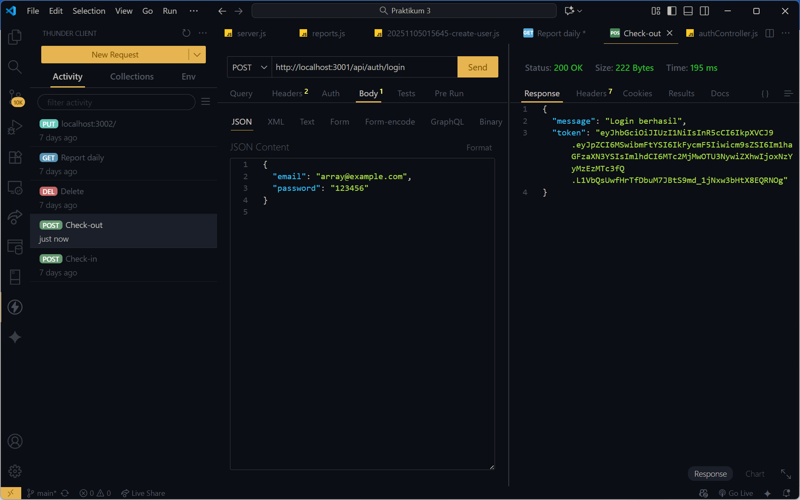

# 🧩 Tugas 6 – Autentikasi API dengan JWT, Bcrypt & Role User

## 📘 Identitas

Nama: Muhammad Array A.K.
NIM: 20230140208
Mata Kuliah: Pengembangan Aplikasi Web
Pertemuan: 6
Dosen Pengampu: Ir. Asroni, S.T., M.Eng

---

## 🎯 Tujuan

Mahasiswa mampu:

* Menerapkan autentikasi API menggunakan **JWT** dan **bcrypt**
* Membuat endpoint **register** dan **login**
* Mengelola role user (`admin`, `mahasiswa`)
* Menguji API menggunakan Thunder Client / Postman

---

## ⚙️ Endpoint yang Diimplementasikan

| No | Endpoint             | Method   | Deskripsi                                   |
| -- | -------------------- | -------- | ------------------------------------------- |
| 1  | `/api/auth/register` | **POST** | Registrasi user baru (admin atau mahasiswa) |
| 2  | `/api/auth/login`    | **POST** | Login dan mendapatkan token JWT             |

---

## 📸 Screenshot Hasil Uji

### 🧩 1. Register User Admin


---

### 🧩 2. Register User Mahasiswa


---

### 🧩 3. Login User & Token JWT



---

### 🧩 4. Struktur Tabel Users di Database


---

## ✅ Checklist Implementasi

| No | Item                                                          | Status |
| -- | ------------------------------------------------------------- | ------ |
| 1  | Model `User` berisi field `nama`, `email`, `password`, `role` | ✅      |
| 2  | Password di-hash menggunakan **bcryptjs**                     | ✅      |
| 3  | JWT token dihasilkan saat login                               | ✅      |
| 4  | Role user (`admin`, `mahasiswa`) berjalan                     | ✅      |
| 5  | Pengujian API dilakukan dengan Thunder Client                 | ✅      |
| 6  | Screenshot tersimpan dalam repo                               | ✅      |
| 7  | Siap dikumpulkan melalui MyKlass                              | ✅      |

---

## 🔗 Link Repository GitHub

```
https://github.com/(username)/(nama-project)
```

---

✅ **Tugas selesai dan siap dikumpulkan.**
