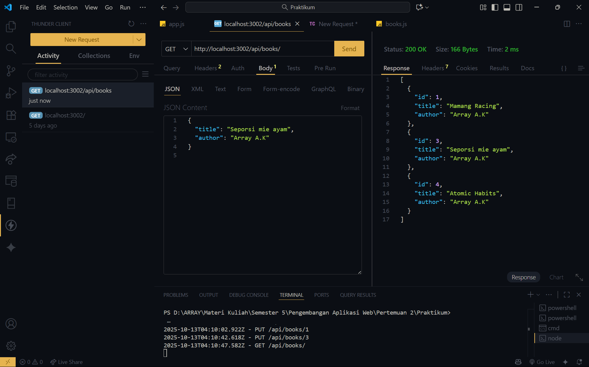
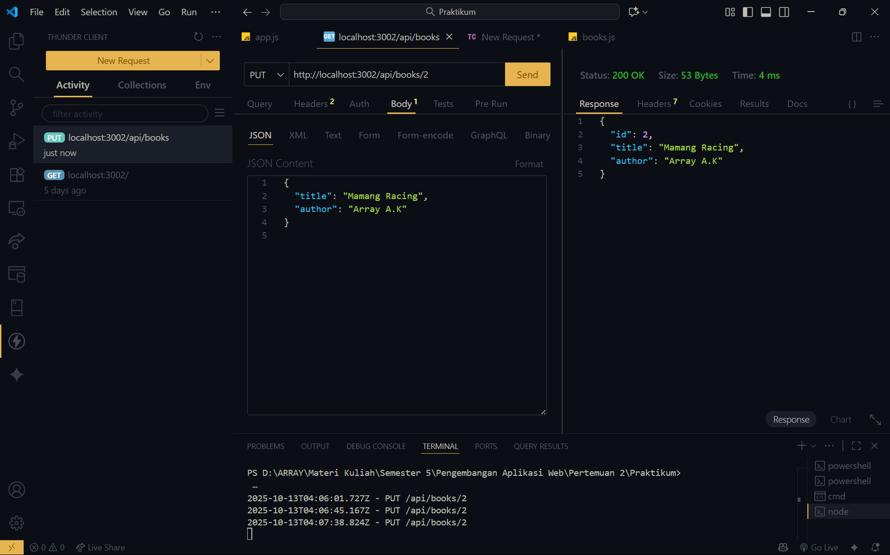
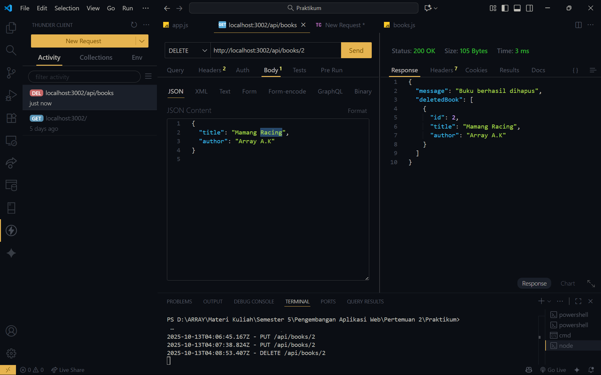

# Tugas 2 - Pengembangan Aplikasi Web
**Nama:** Array A.K  
**NIM:** 20230140208  
**Mata Kuliah:** Pengembangan Aplikasi Web  
**Pertemuan:** 2  

---

## 🧠 Deskripsi Singkat
Aplikasi web sederhana menggunakan **Express.js** dengan fitur **CRUD (Create, Read, Update, Delete)** untuk manajemen buku perpustakaan.  
Data disimpan secara sementara dalam array.

---

## 🧰 Endpoint API

| Method | Endpoint | Deskripsi |
|--------|-----------|------------|
| GET | `/api/books` | Menampilkan semua buku |
| GET | `/api/books/:id` | Menampilkan detail buku berdasarkan ID |
| POST | `/api/books` | Menambah buku baru |
| PUT | `/api/books/:id` | Mengubah data buku |
| DELETE | `/api/books/:id` | Menghapus buku |

---

## 🧾 Screenshot Hasil Uji CRUD

### 1️⃣ GET Semua Buku

### 2️⃣ POST Tambah Buku

### 3️⃣ PUT Update Buku

### 4️⃣ DELETE Hapus Buku

---

## 🧩 Middleware
- Logging request (menampilkan waktu, method, dan URL di console)
- Body parser (`express.json()`)
- CORS

---

## ⚠️ Error Handling
- 404 Not Found Handler
- Global Error Handler

---

## 🧠 Kesimpulan
Aplikasi berjalan dengan baik dan mendukung operasi CRUD melalui Thunder Client.
